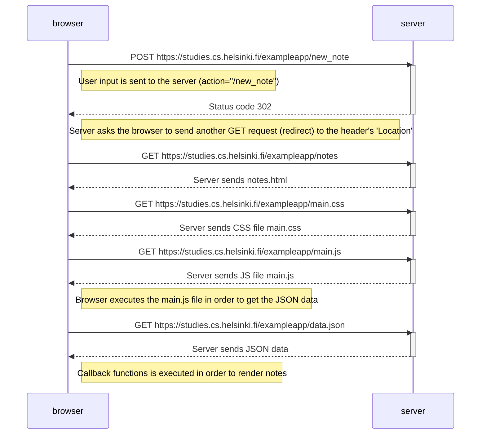

```mermaid
sequenceDiagram
  participant browser
  participant server

  browser->>server: POST https://studies.cs.helsinki.fi/exampleapp/new_note
  activate server
  Note right of browser: User input is sent to the server (action="/new_note")
  server-->>browser: Status code 302
  deactivate server
  Note right of browser: Server asks the browser to send another GET request (redirect) to the header's 'Location'

  browser->>server: GET https://studies.cs.helsinki.fi/exampleapp/notes
  activate server
  server-->>browser: Server sends notes.html
  deactivate server

  browser->>server: GET https://studies.cs.helsinki.fi/exampleapp/main.css
  activate server
  server-->>browser: Server sends CSS file main.css
  deactivate server

  browser->>server: GET https://studies.cs.helsinki.fi/exampleapp/main.js
  activate server
  server-->>browser: Server sends JS file main.js
  deactivate server
  Note right of browser: Browser executes the main.js file in order to get the JSON data

  browser->>server: GET https://studies.cs.helsinki.fi/exampleapp/data.json
  activate server
  server-->>browser: Server sends JSON data
  deactivate server
  Note right of browser: Callback functions is executed in order to render notes
```