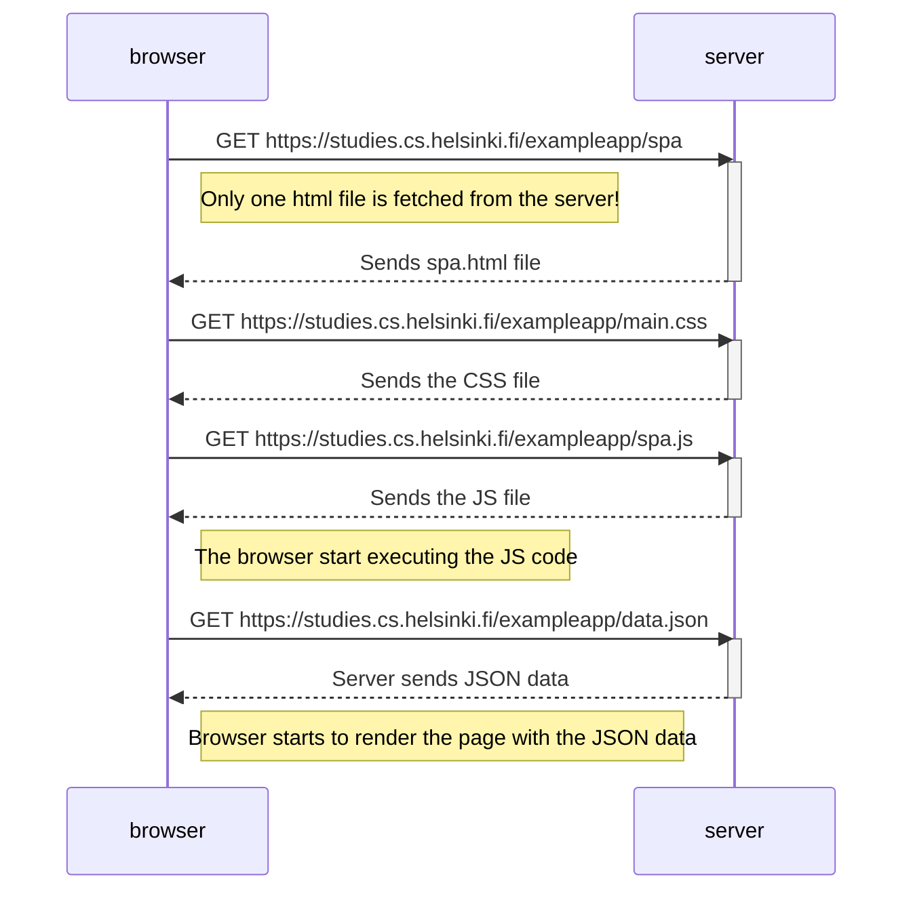

```mermaid
sequenceDiagram
  participant browser
  participant server

  browser->>server: GET https://studies.cs.helsinki.fi/exampleapp/spa
  activate server
  Note right of browser: Only one html file is fetched from the server!
  server-->>browser: Sends spa.html file
  deactivate server

  browser->>server: GET https://studies.cs.helsinki.fi/exampleapp/main.css
  activate server
  server-->>browser: Sends the CSS file
  deactivate server

  browser->>server: GET https://studies.cs.helsinki.fi/exampleapp/spa.js
  activate server
  server-->>browser: Sends the JS file
  deactivate server
  Note right of browser: The browser start executing the JS code

  browser->>server: GET https://studies.cs.helsinki.fi/exampleapp/data.json
  activate server
  server-->>browser: Server sends JSON data
  deactivate server
  Note right of browser: Browser starts to render the page with the JSON data
```